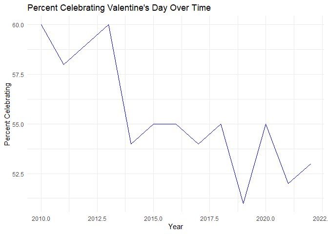

# valentineTool

<!-- badges: start -->
<!-- badges: end -->

The goal of `valentineTool` is to provide an analysis tool for
Valentine’s Day consumer trends. This package helps users visualize
consumer spending over the years for different categories such as candy,
flowers, jewelry, and more. The functions in this package are
particularly useful for analysts, researchers, and businesses looking to
understand changing consumer behavior during Valentine’s Day.

## Installation

You can install the development version of valentineTool from
[GitHub](https://github.com/ETC5523-2024/assignment-4-packages-and-shiny-apps-ChenghaoZeng)
with:

``` r
# Install remotes if not already installed
install.packages("remotes")

# Install the package from GitHub
remotes::install_github("ETC5523-2024/assignment-4-packages-and-shiny-apps-ChenghaoZeng")
```

## Example

This is a basic example which shows you how to solve a common problem:

``` r
library(valentineTool)
library(ggplot2)

# Create the line plot for PercentCelebrating
ggplot(historical_spending, aes(x = Year, y = PercentCelebrating)) +
  geom_line(color = "blue") +                  
  labs(title = "Percent Celebrating Valentine's Day Over Time",
       x = "Year",
       y = "Percent Celebrating") +
  theme_minimal() 
```

 \## Main
Components of valentineTool Package

- historical_spending Dataset:

  - The package includes a dataset (historical_spending) that contains
    data on consumer spending related to Valentine’s Day from various
    years.

  - The dataset includes categories like Candy, Flowers, Jewelry,
    GreetingCards, EveningOut, Clothing, and GiftCards, allowing for
    in-depth analysis of spending trends across different types of
    gifts.

- Visualization Function: plot_trends_custom(data, y_vars):

  - A function to plot multiple spending trends over time.

  - This function allows users to select one or more spending categories
    and generate a line plot to visualize the trends. Different colors
    are assigned to each category to make the plot easy to interpret.

- Package Documentation and Examples

  - README: The README provides an overview of the package, how to
    install it, and basic examples of how to use its features. It also
    contains installation instructions using remotes::install_github()
    and examples to help users get started.

  - Vignette:The vignette would provide an in-depth guide on how to use
    the package. It would include detailed analysis scenarios,
    step-by-step examples, and real-world use cases.

  - Function Documentation:Each function has detailed documentation that
    explains the purpose of the function, its parameters, and example
    usage.

  - Shiny App: A Shiny app is included in the package under inst/shiny
    that allows users to interactively explore different spending
    trends.
